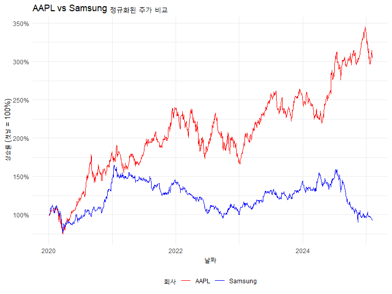

Quantmod library 코드
================
김홍식

<br> <span style="background-color: #ffdce0"> 주의 : 불러온 주가
데이터의 변수명이 숫자로 시작하므로 사용할 때 \` (물결표 버튼)으로
감싸서 사용해야 한다. </span>

<br>

## 패키지 설치 및 로드

먼저 필요한 패키지를 설치(설치되어 있지 않은 경우) 및 로드하고, ggplot2
한글 깨짐 문제를 해결하기 위해 나눔고딕 폰트를 설정.

``` r
if (!requireNamespace("quantmod", quietly = TRUE)) {
   install.packages("quantmod")
}
library(quantmod)
library(tidyverse)
library(lubridate)
theme_set(theme_grey(base_family='NanumGothic'))
```

<br>

## Apple 주식 데이터 로드 및 확인

2020년 1월 1일부터 오늘까지의 Apple Inc. 주식 데이터 로드

``` r
getSymbols("AAPL", from = "2020-01-01", to = Sys.Date())
```

    ## [1] "AAPL"

``` r
head(AAPL)
```

    ##            AAPL.Open AAPL.High AAPL.Low AAPL.Close AAPL.Volume AAPL.Adjusted
    ## 2020-01-02   74.0600   75.1500  73.7975    75.0875   135480400      72.79603
    ## 2020-01-03   74.2875   75.1450  74.1250    74.3575   146322800      72.08827
    ## 2020-01-06   73.4475   74.9900  73.1875    74.9500   118387200      72.66271
    ## 2020-01-07   74.9600   75.2250  74.3700    74.5975   108872000      72.32098
    ## 2020-01-08   74.2900   76.1100  74.2900    75.7975   132079200      73.48436
    ## 2020-01-09   76.8100   77.6075  76.5500    77.4075   170108400      75.04522

<br>

## 아래와 같이 두 개 이상 동시에 로드 가능

야후 파이낸스 데이터를 이용해 2023년 1월 1일부터 오늘까지
삼성전자(005930.KS)와 다른 종목(000660.KS) 데이터 로드

``` r
getSymbols(c("000660.KS", "005930.KS"), 
           src = "yahoo", 
           from = "2023-01-01", 
           to = Sys.Date())
```

    ## [1] "000660.KS" "005930.KS"

<br>

## Apple 주식 차트: 종가와 이동평균선(20일, 50일)

Apple의 주가 차트에 20일과 50일 이동평균선을 추가

``` r
chartSeries(AAPL, name="Apple Inc. Stock Price", TA="addSMA(n=20); addSMA(n=50)")
```

<!-- -->

<br>

## 삼성전자 주식 데이터 로드 및 확인

2020년 1월 1일부터 오늘까지 삼성전자 데이터(005930.KS)를 가져옴

``` r
getSymbols("005930.KS", from = "2020-01-01", to = Sys.Date())
```

    ## [1] "005930.KS"

``` r
head(`005930.KS`)
```

    ##            005930.KS.Open 005930.KS.High 005930.KS.Low 005930.KS.Close
    ## 2020-01-02          55500          56000         55000           55200
    ## 2020-01-03          56000          56600         54900           55500
    ## 2020-01-06          54900          55600         54600           55500
    ## 2020-01-07          55700          56400         55600           55800
    ## 2020-01-08          56200          57400         55900           56800
    ## 2020-01-09          58400          58600         57400           58600
    ##            005930.KS.Volume 005930.KS.Adjusted
    ## 2020-01-02         12993228           48494.80
    ## 2020-01-03         15422255           48758.37
    ## 2020-01-06         10278951           48758.37
    ## 2020-01-07         10009778           49021.93
    ## 2020-01-08         23501171           49900.46
    ## 2020-01-09         24102579           51481.81

<br>

## 삼성전자 주식 차트: 종가와 이동평균선(20일, 50일)

삼성전자의 주가 차트에 20일과 50일 이동평균선을 추가

``` r
chartSeries(`005930.KS`, name = "Samsung Electronics Stock Price", TA = "addSMA(n=20); addSMA(n=50)")
```

<!-- -->

<br>

## 주봉 및 월봉 데이터 변환과 차트

삼성전자 데이터를 주봉, 월봉 데이터로 변환한 후 각각 이동평균선(5일,
10일)을 추가하여 차트를 그림

``` r
samsung_weekly <- to.weekly(`005930.KS`)
chartSeries(samsung_weekly, 
            name = "삼성전자 주봉 차트", 
            TA = "addSMA(n=5); addSMA(n=10)")
```

<!-- -->

``` r
samsung_monthly <- to.monthly(`005930.KS`)
chartSeries(samsung_monthly, 
            name = "삼성전자 월봉 차트", 
            TA = "addSMA(n=5); addSMA(n=10)")
```

<!-- -->

<br>

## 데이터 프레임으로 변환 및 정규화

각 종목의 데이터를 날짜 포함 데이터 프레임으로 변환한 후, 종가만
추출하고 두 데이터를 날짜 기준으로 합침(교집합). 이후 첫날의 종가를
기준으로 정규화하여 비교

``` r
# 데이터 프레임으로 변환
apple_df <- data.frame(date=index(AAPL), coredata(AAPL))
samsung_df <- data.frame(date=index(`005930.KS`), coredata(`005930.KS`))

# 종가만 추출 후 합치기 (Apple: 5번째 열, Samsung: 5번째 열)
apple_df_close <- apple_df %>% select(1, 5)
samsung_df_close <- samsung_df %>% select(1, 5)

data <- merge(apple_df_close, samsung_df_close, by = "date")
colnames(data) <- c("date", "AAPL", "samsung")
str(data)
```

    ## 'data.frame':    1207 obs. of  3 variables:
    ##  $ date   : Date, format: "2020-01-02" "2020-01-03" ...
    ##  $ AAPL   : num  75.1 74.4 74.9 74.6 75.8 ...
    ##  $ samsung: num  55200 55500 55500 55800 56800 58600 59500 60000 60000 59000 ...

``` r
# 날짜 형식 변환
data$date <- as.Date(data$date)

# 데이터 정규화 (첫날의 종가 기준 = 1)
data_normalized <- data %>%
   mutate(AAPL_normalized = AAPL / first(AAPL),
          samsung_normalized = samsung / first(samsung))

# 데이터 정리: 길게 변환하여 두 회사 데이터를 하나의 열로 모음
data_long <- data_normalized %>%
   select(date, AAPL_normalized, samsung_normalized) %>%
   gather(key = "company", value = "price_normalized", -date)
```

<br>

## 정규화된 주가 상승률 비교 차트

정규화된 주가 데이터를 이용하여 Apple과 삼성전자의 주가 상승률 비교
시각화. (첫날을 100%로 설정)

``` r
ggplot(data_long, aes(x = date, y = price_normalized, color = company)) +
   geom_line() +
   scale_color_manual(values = c("AAPL_normalized" = "red", "samsung_normalized" = "blue"),
                      labels = c("AAPL", "Samsung")) +
   labs(title = "AAPL vs Samsung 정규화된 주가 비교",
        x = "날짜",
        y = "상승률 (첫날 = 100%)",
        color = "회사") +
   theme_minimal() +
   scale_y_continuous(labels = scales::percent) +
   theme(legend.position = "bottom")
```

<!-- -->
